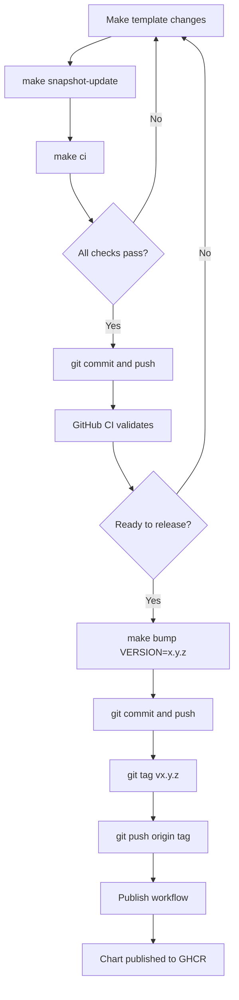

# Developer Workflow Guide

This guide documents the complete development and release workflow for helm-common-lib.

## Table of Contents

- [Overview](#overview)
- [Prerequisites](#prerequisites)
- [Development Workflow](#development-workflow)
- [Release Process](#release-process)
- [CI vs Publish](#ci-vs-publish)
- [Makefile Reference](#makefile-reference)
- [Troubleshooting](#troubleshooting)

## Overview

The helm-common-lib project follows a clear separation of concerns:

- **CI (Continuous Integration)** -- runs all tests and validations on every push/PR
- **Publish workflow** -- packages and publishes to GHCR only after a version tag is pushed
- **Local development** -- uses `make` targets to run the same checks as CI



## Prerequisites

Required tools:

- **Docker** -- All validation tools run inside the `helm-validate` Docker image
- **make** -- For running tasks

One-time setup:

```bash
# Build the validation Docker image locally
make docker-build
```

This builds a Docker image containing all validation tools (helm, helm-unittest, kubeconform, yamllint, chart-testing, checkov, kube-linter, yq). No local tool installation required beyond Docker and make.

## Development Workflow

### Making Template Changes

When you modify any templates in `libChart/templates/`, follow these steps:

#### Step 1: Make your changes

Edit the template files as needed. For example:

```bash
vim libChart/templates/classes/_deployment.tpl
```

#### Step 2: Update the snapshot files

After changing templates, the rendered output will differ from the snapshots. Update them:

```bash
make snapshot-update
```

This runs the build-workflow validation framework which:
- Lints both charts
- Templates `test-chart` with all scenarios in `tests/scenarios/`
- Validates with kubeconform
- Updates `tests/snapshots/*.yaml` with the new expected output

#### Step 3: Review the changes

Check what changed in the snapshot files:

```bash
git diff tests/snapshots/
```

Ensure the changes match your expectations. The snapshot files contain the full rendered Kubernetes manifests for each test scenario.

#### Step 4: Run full local CI

Before committing, run the complete CI suite locally:

```bash
make ci
```

This runs:
1. `make test` -- helm-unittest (unit tests)
2. `make test-schema` -- schema fail-case validation
3. `make validate` -- full 5-layer validation pipeline (syntax, schema, metadata, tests, policy)
4. `make check-validations` -- verify all validation files are wired into orchestrator

If this passes, CI will pass too.

#### Step 5: Commit and push

```bash
git add .
git commit -m "feat: add new field to deployment template"
git push
```

GitHub Actions CI will run automatically and validate everything.

### Adding New Test Cases

When adding new features, add corresponding unit tests:

1. Add test cases to `test-chart/tests/`
2. Update scenarios in `tests/scenarios/` to enable the new feature
3. Run `make snapshot-update` to capture the new output
4. Run `make ci` to verify everything passes

## Release Process

### Creating a New Release

When you're ready to publish a new version:

#### Step 1: Ensure main is clean

Make sure all changes are merged to main and CI is passing:

```bash
git checkout main
git pull
```

#### Step 2: Bump the version

Use the bump script to update all version fields atomically:

```bash
make bump VERSION=0.0.7
```

This updates:
- `libChart/Chart.yaml` -- `version` and `appVersion`
- `test-chart/Chart.yaml` -- `version`, `appVersion`, and `dependencies[0].version`

The script validates:
- VERSION follows semver format (e.g., `0.0.7`, `1.2.3`, `1.0.0-alpha.1`)
- New version differs from current version

#### Step 3: Review the version bump

```bash
git diff
```

You should see version changes in both Chart.yaml files.

#### Step 4: Commit the version bump

```bash
git add .
git commit -m "chore: bump version to 0.0.7"
git push
```

Wait for CI to pass on this commit.

#### Step 5: Create and push the tag

```bash
git tag v0.0.7
git push origin v0.0.7
```

**Important:** The tag must have a `v` prefix and match the version in Chart.yaml (e.g., tag `v0.0.7` for version `0.0.7`).

#### Step 6: Publish workflow runs automatically

The `on-tag.yaml` workflow triggers on the tag push and:
1. Verifies tag matches chart version
2. Packages the chart
3. Pushes to `oci://ghcr.io/<owner>/lib-chart`

Check the Actions tab on GitHub to monitor the publish workflow.

### Version Numbering

Follow semantic versioning (semver):

- **Patch** (0.0.X) -- bug fixes, small changes
- **Minor** (0.X.0) -- new features, backwards compatible
- **Major** (X.0.0) -- breaking changes

Examples:
- `0.0.7` -- patch release
- `0.1.0` -- minor release with new features
- `1.0.0` -- first stable release
- `1.0.0-alpha.1` -- pre-release version

## CI vs Publish

Understanding the separation of concerns:

### CI Workflow (`.github/workflows/on-pr.yaml`)

**Triggers:** Pull requests targeting main

**Responsibilities:**
- Run unit tests (helm-unittest)
- Lint charts (helm lint, chart-testing)
- Validate manifests (kubeconform)
- Check snapshot files for drift
- Verify all tests pass before merge

**Purpose:** Catch issues early during development

### Publish Workflow (`.github/workflows/on-tag.yaml`)

**Triggers:** Git tags matching `v*` (e.g., `v0.0.7`)

**Responsibilities:**
- Verify tag matches chart version
- Package the chart
- Push to GHCR OCI registry

**What it does NOT do:**
- No linting (CI already validated)
- No testing (CI already validated)
- No kubeconform (CI already validated)

**Purpose:** Trust CI and just publish the validated chart

This separation means:
- CI is the single source of truth for quality
- Publish is fast and simple (only packaging)
- No redundant validation steps

## Makefile Reference

Quick reference for all available make targets:

| Command | Description |
|---------|-------------|
| `make help` | Show all available targets with descriptions |
| `make deps` | Update Helm chart dependencies (`helm dependency update test-chart`) |
| `make lint` | Run syntax checks (yamllint + helm lint --strict) on test-chart |
| `make test` | Run helm-unittest on test-chart (unit tests) |
| `make test-schema` | Run schema fail-case tests (invalid values rejected) |
| `make validate` | Run full 5-layer pipeline (syntax, schema, metadata, tests, policy) |
| `make snapshot-update` | Update snapshot files (`tests/snapshots/*.yaml`) |
| `make check-validations` | Verify all validation template files are wired into orchestrator |
| `make ci` | Run full local CI: test + test-schema + test-aggregation + validate + check-validations |
| `make bump VERSION=x.y.z` | Bump version in all Chart.yaml files |
| `make pre-push` | Pre-push safety check: runs CI + verifies no uncommitted snapshot changes |

### Common Workflows

**Daily development:**
```bash
# After making template changes
make snapshot-update
make ci
git commit -am "feat: your changes"
git push
```

**Before pushing:**
```bash
# Run this to ensure everything is ready
make pre-push
```

**Creating a release:**
```bash
make bump VERSION=0.0.7
git commit -am "chore: bump version to 0.0.7"
git push
git tag v0.0.7 && git push origin v0.0.7
```

## Troubleshooting

### Snapshot file drift detected

**Error:**
```
Error: Drift detected! Generated manifests differ from snapshot files
```

**Cause:** Template changes produced different output than what's saved in `tests/snapshots/`

**Fix:**
```bash
# Update the snapshot files
make snapshot-update

# Review the changes
git diff tests/snapshots/

# If expected, commit them
git add tests/snapshots/
git commit -m "chore: update snapshots"
```

### Snapshot files have uncommitted changes

**Error in CI:**
```
❌ ERROR: Snapshot files have uncommitted changes!
```

**Cause:** You modified templates but didn't commit the updated snapshot files

**Fix:**
```bash
# Locally
make snapshot-update
git add tests/snapshots/
git commit --amend --no-edit
git push --force-with-lease
```

### Version mismatch on tag push

**Error:**
```
Error: Tag version (v0.0.7) does not match chart version (0.0.6)
```

**Cause:** Git tag doesn't match the version in `libChart/Chart.yaml`

**Fix:**
```bash
# Delete the wrong tag
git tag -d v0.0.7
git push origin :refs/tags/v0.0.7

# Bump to correct version
make bump VERSION=0.0.7
git commit -am "chore: bump version to 0.0.7"
git push

# Create correct tag
git tag v0.0.7
git push origin v0.0.7
```

### Helm dependency update fails

**Error:**
```
Error: failed to update test-chart dependencies
```

**Cause:** The local libChart dependency reference is broken

**Fix:**
```bash
# From project root
cd test-chart
helm dependency update
cd ..
```

### Unit tests fail

**Error:**
```
Error: helm unittest failed
```

**Cause:** Template changes broke existing unit tests

**Fix:**
1. Check the test output to see which assertions failed
2. Update the test files in `test-chart/tests/` to match new behavior
3. Update scenarios in `tests/scenarios/` if needed
4. Re-run: `make test`

### CI passes locally but fails on GitHub

This should be rare since `make ci` mirrors GitHub CI exactly.

**Debug steps:**
1. Check if you committed all changes (especially `tests/snapshots/`)
2. Ensure your local helm and tool versions match CI (see `.github/workflows/`)
3. Run `make pre-push` before pushing

### Chart packaging fails

**Error during publish:**
```
Error: failed to package chart
```

**Fix:**
1. Verify `Chart.yaml` syntax is valid
2. Check that all required files exist
3. Run locally: `helm package ./libChart`

## Best Practices

### Before Every Commit

```bash
make snapshot-update  # If you changed templates
make ci               # Always run full CI locally
```

### Before Every Push

```bash
make pre-push       # Safety check with clear error messages
```

### When Adding Features

1. Add unit tests first (`test-chart/tests/`)
2. Implement the feature in templates
3. Update test scenarios (`tests/scenarios/`)
4. Run `make snapshot-update`
5. Run `make ci`
6. Commit everything together

### When Cutting Releases

1. Merge all changes to main first
2. Wait for CI to pass on main
3. Then create version bump + tag
4. Never tag a commit that hasn't passed CI

## Getting Help

- **Template structure:** See `docs/TESTING.md`
- **Validation rules:** See `docs/VALIDATIONS.md`
- **Deprecation warnings:** See `docs/DEPRECATIONS.md`
- **Testing roadmap:** See `docs/TESTING_ROADMAP.md`

For questions or issues, check existing GitHub Issues or create a new one.
